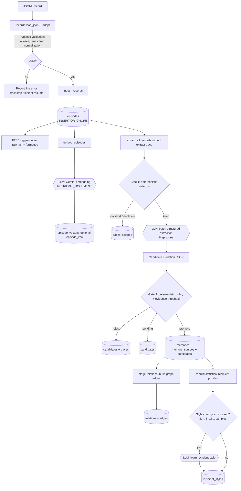

# 1. Data ingestion and memory-building flow

## Detailed path

### Parse and store — no LLM

`load_jsonl()` streams JSONL. `adapt()` maps aliases such as `timestamp`, `transcript`, and `text` to `EpisodeRecord`; Pydantic validates it. Deterministic `ep_<hash>` IDs and a UTC-normalized content hash make imports idempotent.

`ingest_records()` writes parameterized batch `INSERT OR IGNORE` statements to `episodes`; unique `external_id` and `content_hash` constraints decide duplicates. SQLite FTS5 triggers update `episodes_fts` from both raw ASR and formatted text.

### Embed — LLM call followed by SQL

`embed_episodes()` selects only records missing a vector for the configured model/dimension. Gemini returns `RETRIEVAL_DOCUMENT` embeddings; BLOB vectors are inserted in `episode_vectors`. `sqlite-vec`'s `episode_vec` is optional; NumPy cosine over the BLOB table is the correctness-preserving fallback.

### Extract — deterministic gate, schema-constrained LLM

`extract_all()` uses a `LEFT JOIN` with `traces(kind='extract')` to select unprocessed records. `salient()` is not regex/LLM: it checks minimum words and a recent exact-text duplicate window. Surviving batches of eight go to Gemini, which must return structured candidates, speaker stance, exact quotes, and relations. The model identifies language; it does not choose retention.

### Promote — deterministic policy and provenance

`promote()` applies `memory.policy`: allowed types, asserted stance, third-party/prohibited content, first-person commitment rules, confidence, and required evidence. It upserts `candidates`, writes/supersedes `memories`, and stores supporting quotes in `memory_sources`. `stage_relations()` then `build_edges()` resolves links after all promotion. Rejections and empty results also receive trace rows.

### Learn style — statistics before optional LLM

`memory.style` deterministically measures greeting, sign-off, length, punctuation, contractions, and app usage. When a recipient crosses sample checkpoints (2, 4, 8, 16, ...), `style_llm.learn_styles()` makes one structured Gemini call and stores non-topic writing instructions in `recipient_styles`.

LLM/embedding responses are content-addressed in SQLite cache. Offline mode raises on a cache miss instead of using the network; existing vectors/traces make interrupted pipeline runs resumable.
