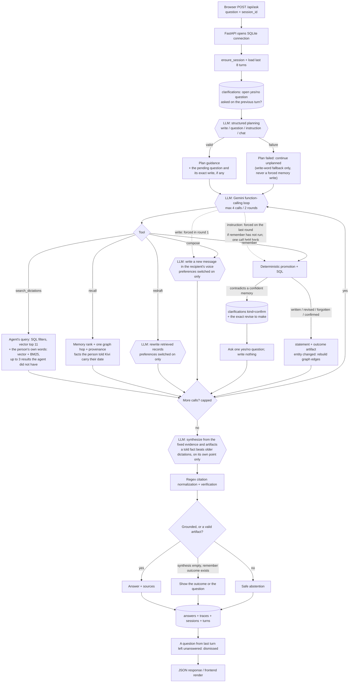

# 2. Question-and-answer flow

## Exact sequence

1. `POST /api/ask` validates a non-empty question. `agent.loop.ask()` gets a session and no more than eight earlier turns with SQL.
2. If the previous turn asked a yes/no question, it is read back from `clarifications` (`kind='confirm'`) with the exact write stored beside it. It is given to both the planner and the tool loop, so "yes" is understood as agreement to that specific change rather than as chat.
3. `agent.plan.make_plan()` calls the light model with a JSON schema. It classifies `write`, `question`, `instruction` or `chat`, plus recipient and literal message. Invalid JSON or an LLM error becomes `Plan(failed=True)`; it does not end the turn.
4. Gemini `converse()` selects among five function tools. Two routings are forced in code, because the model alone got each of them wrong intermittently:
   - a `write` plan forces `compose` in the first round ("Ask Appa if he took his medicine" is a message to write, not a question for Kivi);
   - an `instruction` plan forces `remember` on the **last** round if it has not already run, and holds one tool call back for it. The first round stays free because some instructions need a lookup first ("forget that Priya is on DSPM" has to find the memory id). This fixed "change the DSPM owner from Priya to Rahul" being answered "you haven't mentioned that".
   - A failed plan forces nothing but `compose` on a plain write-word match. It never forces a memory write: a misread write drafts something ignorable, a misread instruction changes what Kivi believes.
5. Tools accumulate stable evidence references and non-evidence artifacts. The closing LLM receives only this fixed set.
6. Code checks citations and claims, persists answer/trace/session turns, dismisses a confirmation that was carried into this turn and left unanswered, and returns JSON.

## Tool-level details

| Tool | LLM work | Database work | Answer material |
| --- | --- | --- | --- |
| `search_dictations` | query embeddings | SQL filters on `episodes`; vector rank of the agent's query (top 11); the person's literal question searched once per turn with vector + BM25, adding up to 3 new results | cited episode evidence |
| `recall` | query embedding | rank active memories; one `edges` hop; load `memory_sources`; mark facts the person told Kivi with the date | facts plus provenance |
| `redraft` | one rewrite call | fetch named episodes, preferences at or above `APPLY_PREFERENCE_AT`, optional recipient profile | artifact; records remain citable |
| `compose` | one low-temperature draft call | styles, preferences at or above `APPLY_PREFERENCE_AT`; inserts `composed_messages` | non-citable compose artifact |
| `remember` | tool selection only | statement, promotion, relations; on conflict a `confirm` clarification; on an entity change a graph rebuild | `say_` evidence and an outcome artifact |

## Confirmations

When a direct instruction contradicts something Kivi holds with confidence, `remember` writes nothing. It stores a `clarifications` row for this conversation (`kind='confirm'`) with the exact `remember(action='revise', …)` that carries the change out, and asks one yes/no question: *"Ashwin is recorded as 'frontend React developer on DSPM'. Replace that with 'manager of DSPM'?"*

- **"yes"** → the stored revise runs. Revise retires the old value first, so it cannot hit the same conflict again — which is exactly what calling `add` twice used to do.
- **"no, keep it"** → `remember(action='confirm')` keeps the old value; the question closes.
- **anything else** → the question is dismissed at the end of the turn, so it does not follow the person around the conversation.

These are kept apart from `kind='dictation'` clarifications, which ingest raises and which surface in the grounding and on the "What Kivi knows" page. A confirmation belongs to one conversation and never appears there.

## Search and safety nuances

Record filters (app, local date/range, local hour) run in SQL **before** ranking, and apply identically to both halves of a search. The agent's query is ranked by vector alone: on the planted questions, adding BM25 to every search lowered hit rates. The person's own words get BM25 because the agent's rewrite can drop the one word a question turns on — "who is running dspm" was searched as "DSPM", and vector search never surfaced "Priya is running point on DSPM". Recall ranks active memory vectors plus memory FTS, then loads `memory_sources`; memories locate evidence but never replace it.

When a fact the person told Kivi disagrees with a dictation from **before** that date, synthesis treats it as their correction — on the point it corrects only. "Rahul leads DSPM now" changes who leads; it does not say Priya left. A dictation from **after** the statement does not silently win either way.

`normalise_citations()` / `apply_citation_guard()` use regex to normalize bracket groups, detect bare references, retain only gathered evidence IDs and remove unknown IDs. A factual answer with no valid support abstains. A compose artifact is text Kivi just created, so it returns without a citation; record-ID stripping stops IDs reaching the recipient. A `remember` outcome is shown as-is if synthesis returns nothing — never the no-evidence line, which is a search result. Empty searches include SQL-derived filter diagnostics instead of claiming the user never said something.
