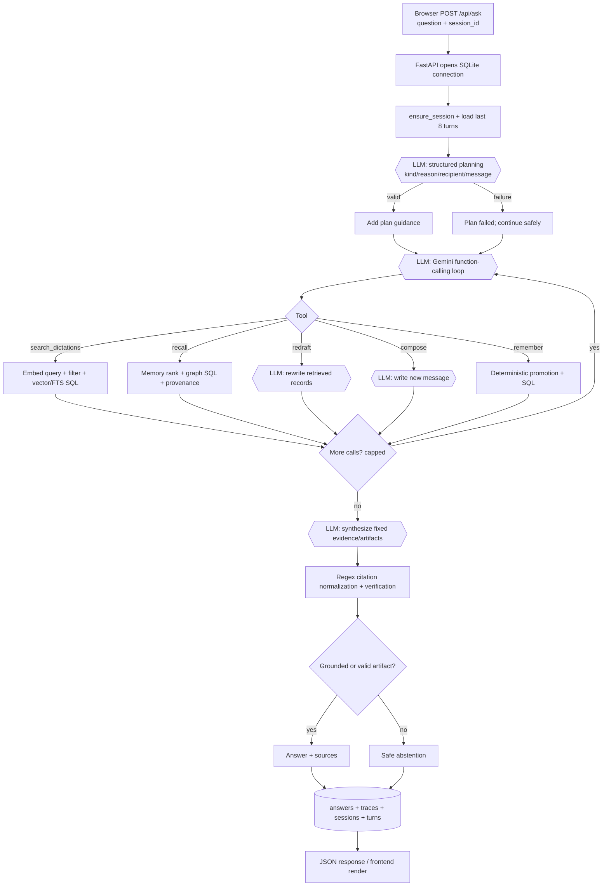

# 2. Question-and-answer flow

## Exact sequence

1. `POST /api/ask` validates a non-empty question. `agent.loop.ask()` gets a session and no more than eight earlier turns with SQL.
2. `agent.plan.make_plan()` calls the light generation model with a JSON schema. It classifies `write`, `question`, `instruction`, or `chat`, plus recipient and literal message. Invalid JSON/LLM errors become `Plan(failed=True)`; they do not end the turn.
3. Gemini `converse()` selects one of five function tools. A successful `write` plan forces `compose` only in the first tool round. This fixes “Ask Appa if he took his medicine,” where the inner question is a message to write, not a question for Kivi.
4. Tools accumulate stable evidence references and non-evidence artifacts. The closing LLM receives only this fixed set, then proposes final answer text.
5. Code checks citations and claims, persists answer/trace/session turns, and returns JSON.

## Tool-level details

| Tool | LLM work | Database work | Answer material |
| --- | --- | --- | --- |
| `search_dictations` | query embedding | filter `episodes`, vector/FTS/recency rank, fetch records | cited episode evidence |
| `recall` | query embedding | rank active memories; optional `edges` hop; load source episodes | facts plus provenance |
| `redraft` | one rewrite call | fetch specified episodes, preferences, optional recipient profile | artifact; records remain citable |
| `compose` | one low-temperature draft call | reads styles/preferences; inserts `composed_messages` | non-citable compose artifact |
| `remember` | only tool selection is LLM | statement, promotion, relation/clarification SQL | direct-user `say_` evidence |

## Search and safety nuances

Record filters (app, local date/range, local hour) run in SQL **before** vector ranking. Gemini produces a `RETRIEVAL_QUERY` embedding; filtered search uses exact NumPy cosine on eligible vectors, unfiltered uses `sqlite-vec` if present or the same NumPy fallback. FTS5 BM25 and recency can be fused with reciprocal rank fusion. Recall ranks active memory vectors plus memory FTS, then loads `memory_sources`; memories locate evidence but never replace it.

`normalise_citations()` / `apply_citation_guard()` use regex to normalize bracket groups, detect bare references, retain only gathered evidence IDs, and remove unknown IDs. A factual answer with no valid support abstains. A new compose artifact is different: it is text Kivi just created, so it returns without a historical citation; record-ID regex stripping prevents leaking IDs to the recipient. Empty searches include SQL-derived filter diagnostics instead of claiming the user never said something.
