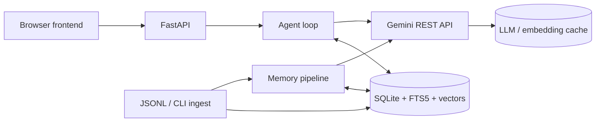

# Kivi application flow guide

This folder documents the runnable Kivi application: backend, browser UI, Streamlit inspection harness, storage, agent loop, and testable flows.

## Reading the diagrams

- **LLM** steps call Gemini through `GeminiClient`.
- **Deterministic** steps are Python policy, SQL, or an explicit regex.
- **Database** nodes are SQLite tables in `data/kivi.db`; WAL supports short-lived request connections.
- Mermaid renders in GitHub, VS Code Mermaid preview, and most Markdown viewers.

The two principal diagrams are [data ingestion](01-data-ingestion.md) and [question answering](02-question-answer.md). [Implementation details](03-implementation-reference.md) identifies model, regex, and database boundaries. [Use cases](04-use-cases.md) walk through normal, write, correction, and no-result paths.

## Important boundary

`episodes` are lossless dictations and are never rewritten during storage. `memories` are curated, versioned conclusions with source provenance. Generated messages go to `composed_messages`, never `episodes`, so Kivi cannot learn its own wording as if the user had spoken it.
